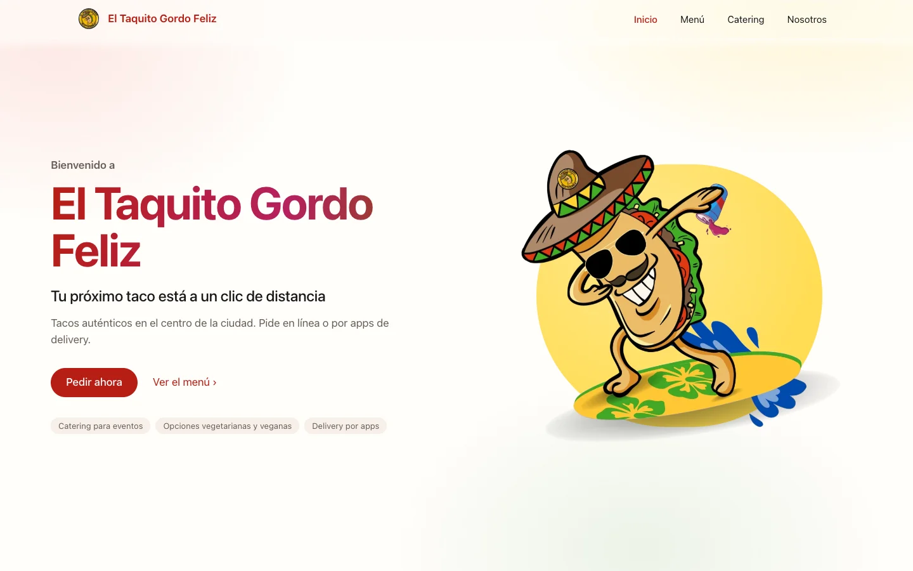
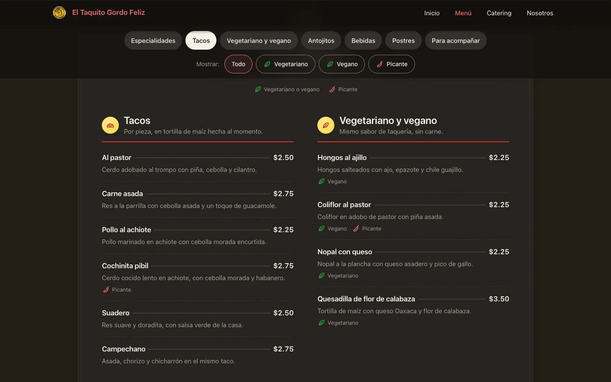
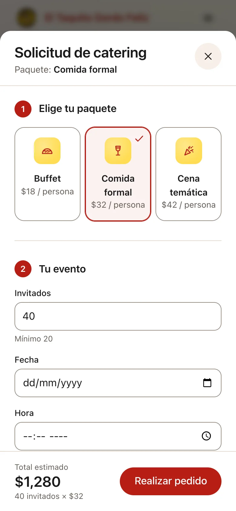

# 🌮 El Taquito Gordo Feliz

Sitio web de una taquería **ficticia**, hecho como proyecto universitario y
rediseñado con un sistema de diseño inspirado en las páginas de producto de Apple.

**En vivo:** https://taquito.vercel.app

> Proyecto universitario sin fines comerciales: la taquería, el menú y los
> precios son ficticios. El formulario de catering valida los datos de punta a
> punta, pero no guarda ni envía nada.

| Portada | La carta (tema oscuro) | Catering en móvil |
| --- | --- | --- |
|  |  |  |

## Qué tiene

- **Cuatro páginas:** inicio, menú, catering y nosotros, más una 404 propia.
- **Claro y oscuro** según la preferencia del sistema, con contrastes medidos
  (texto ≥ 4.5:1, iconos y bordes ≥ 3:1) en los dos temas.
- **Accesible:** áreas táctiles de 44px, navegación completa con teclado, foco
  retenido en el modal, enlace para saltar al contenido, y respeto a
  `prefers-reduced-motion`, `prefers-contrast` y `prefers-reduced-transparency`.
- **Todo el contenido se ve sin JavaScript:** el HTML se genera al compilar. El
  JS añade las interacciones: el formulario de catering, el filtro del menú y
  las flechas de la galería.
- **Menú** con filtro por etiquetas (vegetariano, vegano, picante) y pestañas
  que siguen la sección visible.
- **Catering** con paquetes como tarjetas, total estimado y validación en el
  navegador y en el servidor.
- **Ligero:** sin frameworks ni librerías en el navegador; imágenes en WebP con
  `srcset`; iconos SVG propios.

## Stack

- **[Vite](https://vitejs.dev/)** — servidor de desarrollo y build multipágina.
- **[TypeScript](https://www.typescriptlang.org/)** — tipado estricto en todo el proyecto.
- **[Tailwind CSS v4](https://tailwindcss.com/)** — estilos con tokens de diseño propios.
- **Función de Vercel** (`api/`) — validación del formulario en el servidor, sin dependencias.
- **[Vitest](https://vitest.dev/)** y **[ESLint](https://eslint.org/)** — tests y lint.
- **GitHub Actions** — `npm run check` en cada push a `main` y en cada PR.

## Páginas

| Archivo          | Ruta        | Descripción                                          |
| ---------------- | ----------- | ---------------------------------------------------- |
| `index.html`     | `/`         | Inicio: portada, especialidades y delivery.          |
| `menu.html`      | `/menu`     | La carta completa, con filtro y pestañas.            |
| `catering.html`  | `/catering` | Paquetes y formulario de solicitud.                  |
| `about.html`     | `/about`    | Historia de la taquería y galería de fotos.          |
| `404.html`       | —           | Página no encontrada (Vercel la sirve sola).         |

## Desarrollo

Necesitas Node 24 (está en `.nvmrc`).

```bash
npm install      # instala dependencias
npm run dev      # servidor local (http://localhost:5173), /api/solicitud incluido
npm run check    # lint + typecheck + tests + build + revisión de dist (igual que CI)
npm run preview  # previsualiza el build de producción
```

Otros: `npm run lint`, `npm run typecheck`, `npm run test`, `npm run build`.

## Estructura

```
.
├── index.html · menu.html · catering.html · about.html · 404.html   # páginas
├── api/
│   └── solicitud.ts      # función de Vercel: POST /api/solicitud
├── build/
│   ├── html.ts           # plugin de Vite: cabecera, pie, menú, paquetes y SEO
│   ├── api-dev.ts        # sirve /api/solicitud en npm run dev
│   └── site.ts           # URL del sitio, dirección, horario y aviso
├── src/
│   ├── data/menu.ts      # ÚNICA fuente del menú, precios y paquetes de catering
│   ├── lib/solicitud.ts  # validación de la solicitud (la usa el servidor)
│   ├── main.ts           # entrada compartida (menú, año, galería, revelado)
│   ├── ts/
│   │   ├── menu.ts       # menú móvil + estado de la barra al hacer scroll
│   │   ├── catering.ts   # formulario de catering
│   │   ├── gallery.ts    # flechas y contador de la galería deslizable
│   │   ├── menu-page.ts  # filtro y pestañas de la página de menú
│   │   └── reveal.ts     # revelado al entrar en pantalla (nace visible)
│   └── styles/main.css   # Tailwind + tokens de diseño (claro y oscuro)
├── public/
│   ├── photos/           # imágenes de los platillos
│   ├── img/              # derivadas: WebP, recortes sin fondo, logo, favicon
│   ├── icons.svg         # iconos dibujados a mano (sprite SVG)
│   ├── og.png            # imagen para compartir (1200×630)
│   ├── robots.txt
│   └── apple-touch-icon.png
├── tests/                # tests de la función de Vercel (fuera de api/ a propósito)
├── scripts/check-dist.mjs  # revisión del build que corre en CI
├── assets-src/           # originales de las imágenes optimizadas (no se publican)
├── docs/                 # capturas y material del proyecto (no se publica)
├── vite.config.ts
└── vercel.json
```

## Cómo cambiar contenido compartido

- **Menú, precios o paquetes:** edita `src/data/menu.ts`. La portada, `/menu`,
  `/catering` y la validación del servidor salen de ahí.
- **Cabecera o pie:** edita `build/html.ts`. En los HTML solo hay marcadores como
  `<!--#header current="menu"-->`.
- **Dirección, horario o aviso:** edita `build/site.ts`.

## Despliegue

Vercel publica `main` automáticamente (`npm run build` → `dist/`, y `api/` como
funciones). La URL del sitio para SEO se puede cambiar con la variable de
entorno `SITE_URL`.

## Notas

- **Formulario de catering:** `api/solicitud.ts` vuelve a validar los datos,
  recalcula el total con los precios de `src/data/menu.ts`, descarta el spam con
  un campo trampa y registra un resumen en los logs de Vercel (sin correo ni
  teléfono). No se guarda ni se envía a nadie, y no se piden datos de tarjeta.
- **No pongas tests dentro de `api/`:** Vercel publica cada archivo de esa
  carpeta como función. `npm run check` falla si encuentra uno.
- **Tema:** sigue la preferencia del sistema; no hay interruptor.
- **Caché de Vite:** después de tocar `@theme` en `main.css` o `vite.config.ts`,
  reinicia `npm run dev` (y borra `node_modules/.vite` si algo se ve raro).

## Créditos

Carpool Venom · D'mitri Medina Novelo y William Moran Ramírez.
